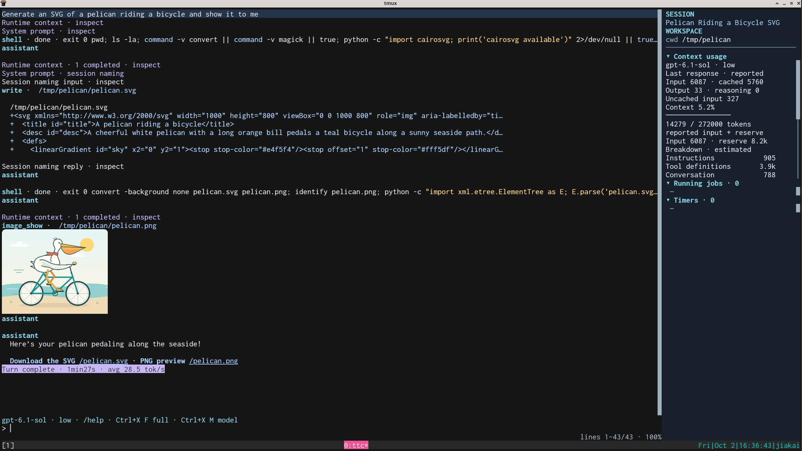
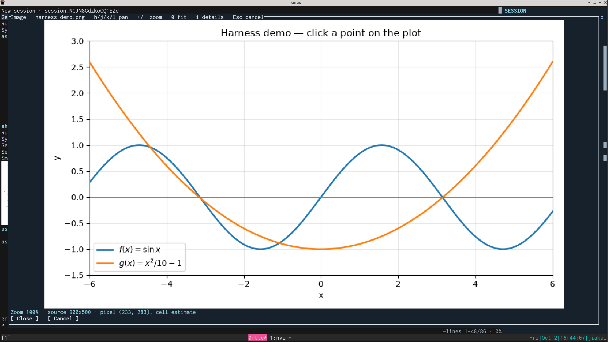
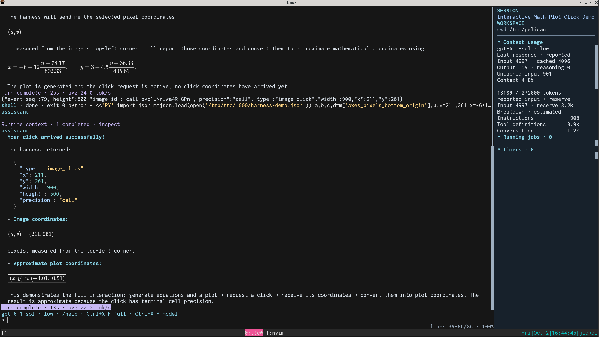
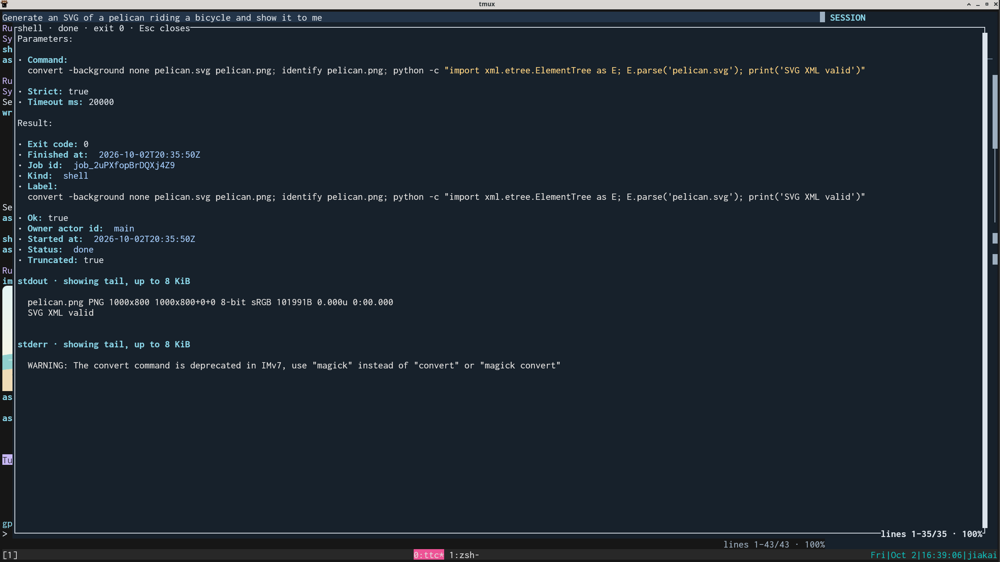

# TTC - True Terminal Coding

TTC is an opinionated coding agent for terminal-native, research-heavy coding
workflows on headless servers. If you agree with the following, then TTC may
be helpful to you:

* Agents should be collaborative tools, not owners of the whole project.
* A minimalistic, fully terminal-based workflow is productive. Agents should
  live in tmux as normal processes instead of having their own background
  session management or a lifespan longer than their TUIs. No need for
  complications like a server-client agent architecture.
* Agents should not try to decide the safety of individual tool calls. Users
  choose their isolation boundary: run directly, use the opt-in `ttc rail`
  [filesystem wrapper](#filesystem-guardrails-with-rail), or provide an external
  container. Agents should be fully autonomous within the predefined boundary.
* Agents should provide a small set of useful LLM-facing tools to make effective
  use of LLM capabilities.
* Agents should work out of the box, with minimum configurations needed.
* Agents only need to run on Linux hosts.

Besides conventional tools like file editing, web access, and shell execution,
TTC also supports the following:

* Background jobs, subagents, and wakeup timers.
* Built-in planning, tmux, LSP and TTC-configuration skills.
* Image display and confirmed point coordinates delivered to the LLM as a later
  runtime message. Native binary input through `read()`: original PNG/JPEG/
  non-animated GIF images and provider-announced documents such as PDF, Word,
  PowerPoint and spreadsheets.
* Inline and block math using MathJax.
* Transparency of all internal processes. Click a message or tool row to inspect
  raw messages and saved tool details.

TTC reads `AGENTS.md` and `.agents/skills`. TTC deliberately omits things like
MCP, plugins, and modes such as plan mode.

The [requirements](docs/requirement.md), [implementation design](docs/design.md),
[tool contracts](docs/tools.md), [compaction design](docs/compaction.md), and
[system prompt](docs/system_prompt.md) describe the intended behavior and
architecture. TTC's design draws from [Codex](https://github.com/openai/codex),
[pi](https://github.com/earendil-works/pi), and
[OpenCode](https://github.com/anomalyco/opencode).

## Screenshots

A few examples of TTC's terminal-native workflow:

**Images in the conversation.** Generate an image and view it alongside the
commands and edits that produced it—here, a pelican riding a bicycle.



**Interactive plots.** Open a plot, pan or zoom, and confirm a point to send its
pixel coordinates back to the agent.



**Rendered math.** Inline and block formulas make explanations easier to follow,
including converting a selected point from image pixels to plot coordinates.



**Inspectable tool calls.** Open a tool row to see its parameters, command,
status, and captured output.



## Installation

Build on Linux with Go 1.26.5 or later. `make` generates embedded
[prompt assets](prompt/README.md) before compiling. Install `rg` for recursive file search
and GNU `diff` (`diffutils` on Arch) for edit previews. If `diff` is unavailable,
edits still work, but previews are unavailable.

OpenAI is the only compiled production provider and the default (`--provider
openai`). TTC uses ChatGPT subscription authentication, not API keys.
Device-code login prints a URL and code that you can authorize from another
device; the server does not need a browser:

```sh
make build
./ttc --login
./ttc                         # start with the last model choice
```

Instead of logging in, you can explicitly copy existing Codex subscription
credentials into TTC's private store:

```sh
./ttc --import-codex-auth "$HOME/.codex/auth.json"
```

Web search uses Exa's public, rate-limited endpoint by default. To use your own
key, create a private tool config (never included in LLM prompts):

```sh
mkdir -p "${XDG_CONFIG_HOME:-$HOME/.config}/ttc"
install -m 600 /dev/null "${XDG_CONFIG_HOME:-$HOME/.config}/ttc/web-search.json"
```

Edit that file to contain `{"api_key":"YOUR_EXA_KEY"}`. Optional `endpoint`
selects an HTTP(S) backend URL. `--web-search-config PATH` selects another file;
restart TTC after changes. Inside rail, also recreate it if the host replaced an
imported config file; see [restart rules](default-skills/ttc-config/SKILL.md#restart-rules).
Keep credential files private (mode 0600). No key is supplied through tool arguments.

Use Kitty as the terminal client for TTC's graphics features. When
running through tmux, enable graphics passthrough in your tmux configuration:

```tmux
set -g allow-passthrough on
```

For math rendering, install Node, npm, and `rsvg-convert` (run `sudo pacman -S
nodejs npm librsvg` on Arch). Run `./ttc --install-math` to prepare MathJax
without login. Rendering reuses a persistent Node process; ordinary images need
none of these dependencies. See [math setup](docs/mathjax.md).

## Usage

Start TTC in your project directory, or select the workspace explicitly:

```sh
/path/to/ttc --workdir /path/to/project
```

### Filesystem guardrails with rail

`ttc rail` starts an interactive shell in tmux, inside a Bubblewrap filesystem
sandbox. Run `ttc` or other commands in its panes. There is one server per user
and absolute, symlink-resolved workdir:

```sh
ttc rail                       # attach or create for cwd
ttc rail --workdir /project     # attach or create for another workspace
ttc rail --list                 # list live workdirs and tmux sessions
```

On Arch Linux, install `bubblewrap` and `tmux` with `sudo pacman -Syu --needed
bubblewrap tmux`. Launch rail **without sudo**; the host must allow unprivileged
user namespaces.

Host executables/libraries and `/etc` are read-only. The workdir and TTC's
existing data/cache directories are writable. Home, `/tmp` and `/run` are
private. Existing Bash/Zsh startup files, `~/.gitconfig`, Zsh/tmux/Neovim config
directories (including `~/.config/nvim`), TTC configuration, and ancestor
`AGENTS.md` files and skill directories are imported read-only. Existing Zsh
history is shared writable.
The hostname is `{hostname}-ttc`, and the process namespace is private.
**Networking is shared with the host:** host services, the LAN and the Internet
remain accessible.

Detach to keep an instance running; rerun `ttc rail` in that workdir to attach.
Additional tmux sessions share its sandbox; attach uses tmux's usual session
selection. Closing the last session terminates the sandbox. To stop explicitly,
run `tmux kill-server` inside it. Runtime records live under
`$XDG_RUNTIME_DIR/ttc/rail`.

#### Rail configuration

Rail reads `${XDG_CONFIG_HOME:-~/.config}/ttc/rail.json`, then
`<workdir>/ttc-rail.json` (no ancestor search). Allow/deny lists combine;
project allows replace global allows with the same destination. **Denies always
win.** Below is an example global config:

```json
{
  "authorize_services": ["docker", "ssh-agent"],
  "ttc_allow_ssh_auth_sock": false,
  "allow": ["~/tools"],
  "deny": ["~/.ssh"]
}
```

A project config might contain:

```json
{
  "allow": [
    {"source": "/datasets", "dest": "/data"},
    {"source": "../results", "mode": "rw"},
    "docker",
    "ssh-agent"
  ],
  "deny": ["./secrets", {"dest": "/data/private"}]
}
```

**TTC itself unsets `SSH_AUTH_SOCK` by default**, inside or outside rail, so tool
processes do not inherit SSH-agent access. Set `ttc_allow_ssh_auth_sock: true`
in **global** `rail.json` to preserve it; project config cannot opt in.

**Rail is write containment, not a complete security boundary.** The workspace,
TTC credentials/history/cache, and any additional read-write allows remain
modifiable. Read-only secrets can still be read and sent over the shared
network. Docker access can grant control of the host and defeats filesystem
isolation. SSH-agent access permits authentication/signing with loaded keys;
authorize it only for trusted workloads.

The bundled `ttc-config` skill helps the agent configure supported rail,
web-search and launch settings. Inside rail, read-only config changes must be
made from the host; the skill does not bypass that boundary.
For implementation boundaries, see [rail layering](docs/design.md#rail-layering).

### Interactive usage

Enter starts a normal turn while idle; while busy, it steers the active main
turn after the current LLM response and foreground tool batch finish. Alt+Enter
sends while idle or queues a new turn FIFO while busy. Neither key steers child
agents. After dismissing a question, the next message redirects the current turn
instead.

Use `/help` for the keyboard and command guide. Up/Down recall prompts across
sessions and restarts. Ctrl-R searches the most recent 1000 prompts (at most
8 MiB), newest matches first. Every whitespace-separated term must match a
case-insensitive substring, in any order; matches are highlighted. Enter fills
the input and Esc cancels.

Multiple TTC instances can share the default data directory and the same
workspace. Each starts an independent conversation; workspace conflicts are your
responsibility. `/load ID` or `--session ID` copies writable history into a new
session at its last complete tool exchange, with only new work undoable.
Archived predecessors open read-only. Loading never restores files or live jobs.
TTC does not repair interrupted work; files can be ahead of saved history after
a crash. Incompatible history schemas and obsolete inline-binary attachment
records are rejected; no automatic migration is performed.

At a compaction boundary, loading also recovers saved, undelivered notifications
(including completed subagent answers) and automatically resumes their delivery.
It does not replay already delivered events or restore memory-only queued prompts
and unadmitted steers. Ordinary loads do not restore pending notifications.

The first model request includes cwd, whether Git inspection found a repository,
and its branch (`detached` when HEAD has no branch). Git is optional.
Foreground shell commands default to a 20-second timeout and cannot disable it.
Background commands have no default timeout; they can set an explicit deadline.

Background jobs, subagents, and timers belong to the active runtime. Compaction
preserves them; switching sessions or exiting cancels them. Use tmux for work
that needs to outlive TTC.

Main, child and aside compaction have a **10-minute timeout** and remain
cancelable. Transient model-stream failures retry automatically before output is
delivered. A failed or interrupted turn pauses automatic notification turns;
pending messages stay queued. Send a prompt, successfully `/compact` or `/load`,
or change session/model to resume. `/compact [focus]` while idle uses the same
handoff as automatic compaction.

Original `read()` image bytes and rendered thumbnails/formulas share a
disposable filesystem cache at `${XDG_CACHE_HOME:-~/.cache}/ttc/assets`: **4 GiB
total**, with least-recently-used eviction and **30-day idle retention**. Active
images are not pinned.

## Testing

Validation uses self-contained unit tests and a **local mock OpenAI HTTP
server** with synthetic credentials. Normal tests make no live inference
requests:

```sh
make test
make full-test                # all automated suites; prerequisites in tests/README.md
make check                    # race tests and vet
make integration              # PTY workflows and automated demos; needs Python 3
make rail-integration         # real Bubblewrap/tmux PTY regression; needs user namespaces
make demo                     # interactive TUI, local mock server; needs Python 3
```

The demo exercises all 20 tool types on a copied research fixture and renders
its Markdown notebook. It requires no subscription credentials and makes no
live inference requests; the mock also handles web search locally. Type
`Run demo`, answer the question, and inspect rows with a click or Tab.

See [testing and demo instructions](tests/README.md) for coverage, individual
regressions, saved artifacts, and automated Kitty screenshots on headless
Linux.

## License

TTC is licensed under the [MIT License](LICENSE).
